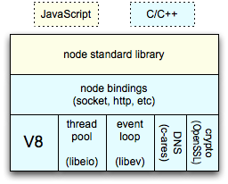

# NodeJS

Try changing the registry to the http version rather that the default https one using the command：

```shell
npm config set registry http://registry.npmjs.org/
```

## 基本知识

可以直接require一个目录，假设有一个目录名为folder，如：

```js
var myMod = require('./folder')
```

此时，Node将搜索整个folder目录，Node会假设folder为一个包并试图找到包定义文件package.json。如果folder目录里没有包含package.json文件，Node会假设默认主文件为index.js，即会加载index.js。如果index.js也不存在，那么加载将失败。

如果模块名不是路径，也不是内置模块，Node将试图去当前目录的node_modules文件夹里搜索。如果当前目录的node_modules里没有找到，Node会从父目录的node_modules里搜索，这样递归下去直到根目录。

------

By default node tries to load `module/index.js` when you `require('module')`, any other file name won't work unless you set the `main` field of `package.json` to point to it.

------

NodeJS内部架构图：



## 值得关注

- [Node-Webkit](github.com/rogerwang/node-webkit)
- [apiDoc](https://github.com/apidoc/apidoc)
- [Docco](http://jashkenas.github.io/docco/)
- [libuv](http://libuv.org/)
- [Async.js](https://github.com/caolan/async)
- [lodash](https://lodash.com)

## 推荐阅读

- [libuv中文教程](http://luohaha.github.io/Chinese-uvbook/)
- [You-Dont-Know-JS Series](https://github.com/getify/You-Dont-Know-JS)
- [awesome-electron](https://github.com/sindresorhus/awesome-electron)
- [An Inside Look at the Architecture of NodeJS](http://mcgill-csus.github.io/student_projects/Submission2.pdf) √
- [Node.js Style Guide](https://github.com/felixge/node-style-guide) √
- [Anatomy of an HTTP Transaction](https://nodejs.org/en/docs/guides/anatomy-of-an-http-transaction/) √
- [module best practices](https://github.com/mattdesl/module-best-practices) √
- [stream-handbook](https://github.com/substack/stream-handbook) √ 值得关注使用
- [Mastering the filesystem in Node.js](https://medium.com/@yoshuawuyts/mastering-the-filesystem-in-node-js-4706b7cb0801#.dermpbiul)√
- [Node.js: Style and structure](http://caolan.org/posts/nodejs_style_and_structure/) √ 非常赞！


