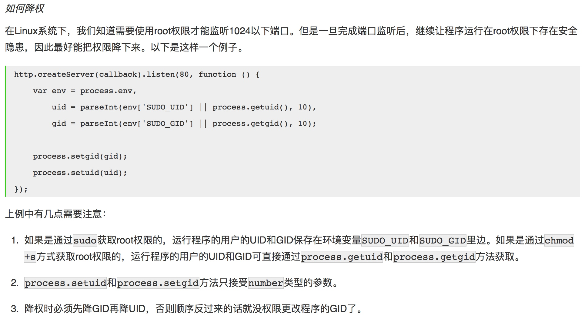

# NodeJS

## 基本知识

Try changing the registry to the http version rather that the default https one using the command：

```shell
npm config set registry http://registry.npmjs.org/
```

------

To get the exact filename that will be loaded when `require()` is called, use the `require.resolve()` function.

Here is the high-level algorithm in pseudocode of what require.resolve does:

```
require(X) from module at path Y
1. If X is a core module,
   a. return the core module
   b. STOP
2. If X begins with './' or '/' or '../'
   a. LOAD_AS_FILE(Y + X)
   b. LOAD_AS_DIRECTORY(Y + X)
3. LOAD_NODE_MODULES(X, dirname(Y))
4. THROW "not found"

LOAD_AS_FILE(X)
1. If X is a file, load X as JavaScript text.  STOP
2. If X.js is a file, load X.js as JavaScript text.  STOP
3. If X.json is a file, parse X.json to a JavaScript Object.  STOP
4. If X.node is a file, load X.node as binary addon.  STOP

LOAD_AS_DIRECTORY(X)
1. If X/package.json is a file,
   a. Parse X/package.json, and look for "main" field.
   b. let M = X + (json main field)
   c. LOAD_AS_FILE(M)
2. If X/index.js is a file, load X/index.js as JavaScript text.  STOP
3. If X/index.json is a file, parse X/index.json to a JavaScript object. STOP
4. If X/index.node is a file, load X/index.node as binary addon.  STOP

LOAD_NODE_MODULES(X, START)
1. let DIRS=NODE_MODULES_PATHS(START)
2. for each DIR in DIRS:
   a. LOAD_AS_FILE(DIR/X)
   b. LOAD_AS_DIRECTORY(DIR/X)

NODE_MODULES_PATHS(START)
1. let PARTS = path split(START)
2. let I = count of PARTS - 1
3. let DIRS = []
4. while I >= 0,
   a. if PARTS[I] = "node_modules" CONTINUE
   c. DIR = path join(PARTS[0 .. I] + "node_modules")
   b. DIRS = DIRS + DIR
   c. let I = I - 1
5. return DIRS
```

------

Modules are cached based on their resolved filename. Since modules may resolve to a different filename based on the location of the calling module (loading from node_modules folders), it is not a guarantee that require('foo') will always return the exact same object, if it would resolve to different files.

------

NodeJS内部架构图：


------

`Buffer`与字符串有一个重要区别: 字符串是只读的，并且对字符串的任何修改得到的都是一个新字符串，原字符串保持不变。至于`Buffer`，更像是可以做指针操作的C语言数组。例如，可以用`[index]`方式直接修改某个位置的字节。

而`.slice`方法也不是返回一个新的`Buffer`，而更像是返回了指向原`Buffer`中间的某个位置的指针，因此对`.slice`方法返回的`Buffer`的修改会作用于原`Buffer`。

也因此，如果想要拷贝一份`Buffer`，得首先创建一个新的`Buffer`，并通过`.copy`方法把原`Buffer`中的数据复制过去。这个类似于申请一块新的内存，并把已有内存中的数据复制过去。

------

任何一个进程都有启动进程时使用的命令行参数，有标准输入标准输出，有运行权限，有运行环境和运行状态。在NodeJS中，可以通过process对象感知和控制NodeJS自身进程的方方面面。另外需要注意的是，process不是内置模块，而是一个全局对象，因此在任何地方都可以直接使用。

------

`cluster`模块是对`child_process`模块的进一步封装，专用于解决单进程NodeJS Web服务器无法充分利用多核CPU的问题。使用该模块可以简化多进程服务器程序的开发，让每个核上运行一个工作进程，并统一通过主进程监听端口和分发请求。

------

NodeJS程序的标准输入流（stdin）、一个标准输出流（stdout）、一个标准错误流（stderr）分别对应`process.stdin`、`process.stdout`和`process.stderr`，第一个是只读数据流，后边两个是只写数据流，对它们的操作按照对数据流的操作方式即可

------



------

JS自身提供的异常捕获和处理机制 —— `try..catch..`，只能用于同步执行的代码。

------

`exports`和`module.exports`这两者有什么区别呢？

其实在NodeJS内部，模块真正返回的是`module.exports`对象，而`exports`只是`module.exports`的引用而已。如下：

```javascript
exports = module.exports = {};
```

如果你直接赋值一个函数（function）或者一个对象（`{}`）给`exports`，这样的话就破坏了`exports`和`module.exports`的引用关系了，而模块将会返回空对象。所以当我们需要暴露一个函数或者一个对象时，应该直接赋值给`module.exports`而不是`exports`。

## 值得关注

- [libuv](http://libuv.org/)
- [Async.js](https://github.com/caolan/async)
- [lodash](https://lodash.com)
- [statsd](https://github.com/etsy/statsd)
- [electron](https://github.com/atom/electron)

## 推荐阅读

- [libuv中文教程](http://luohaha.github.io/Chinese-uvbook/)
- [You-Dont-Know-JS Series](https://github.com/getify/You-Dont-Know-JS)
- [awesome-electron](https://github.com/sindresorhus/awesome-electron)
- [An Inside Look at the Architecture of NodeJS](http://mcgill-csus.github.io/student_projects/Submission2.pdf) √
- [Node.js Style Guide](https://github.com/felixge/node-style-guide) √
- [Anatomy of an HTTP Transaction](https://nodejs.org/en/docs/guides/anatomy-of-an-http-transaction/) √
- [module best practices](https://github.com/mattdesl/module-best-practices) √
- [stream-handbook](https://github.com/substack/stream-handbook) √ 值得关注使用
- [Mastering the filesystem in Node.js](https://medium.com/@yoshuawuyts/mastering-the-filesystem-in-node-js-4706b7cb0801#.dermpbiul) √
- [Node.js: Style and structure](http://caolan.org/posts/nodejs_style_and_structure/) √ 非常赞！
- [七天学会NodeJS](http://nqdeng.github.io/7-days-nodejs/) √ 挺不错！


